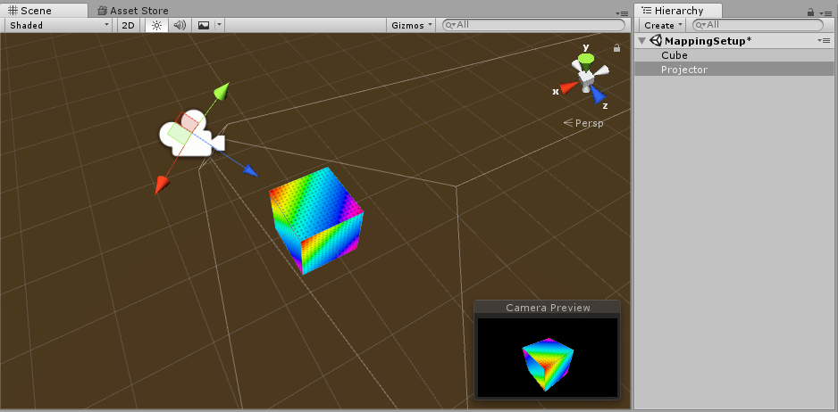
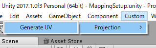
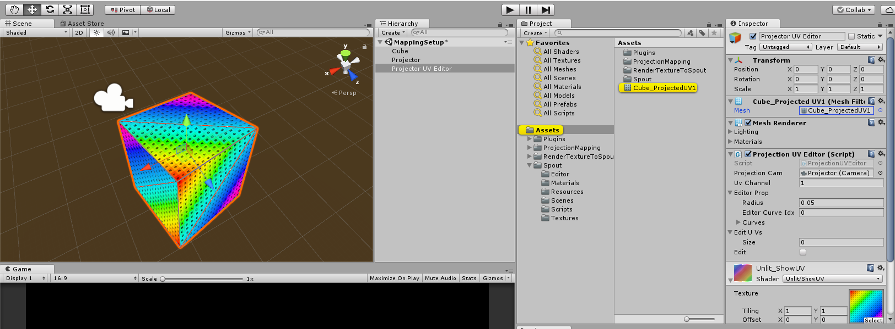
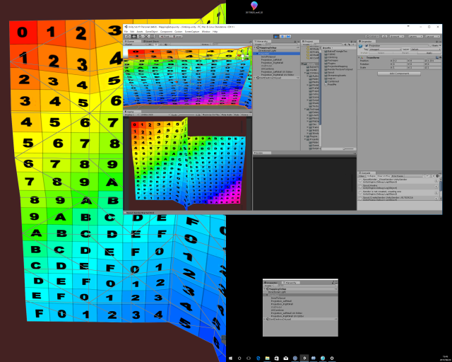
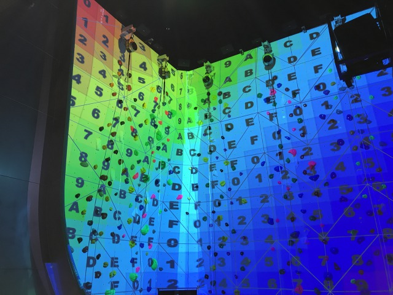

# ProjectionMapping-unity

this is simple Projection-Mapping tool for Unity.

- Generate Projection-UV from projector
- Edit Projection-UV in run-time
- Use Spout or something to projection in editing
- work-in-progress

Adjust the position of the projector object according to the position of the actual projector

`Custom/Projection/Generate UV` to Generate projection-UV from projector

mesh with projection UV, and UV Editor is generated

you can edit generated UV with mouse-drag in Game-View

## Usage

- [VRだけじゃないVR ZONE 絶叫必至の『ナイアガラドロップ』と難攻不落の『トラップクライミング』](http://www.moguravr.com/vr-zone-activity/)

## Future

- [QuadWarp用の射影変換(ホモグラフィ)行列の導出](http://qiita.com/fuqunaga/items/f1534b50ba483e884715)
- 簡単なメッシュ作るやつ
- 編集しやすくする